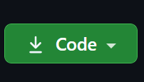

# React & Rails Test Project

## `Date created`
##### 3/16/2021

This app is made to explore the interaction between databases and react ui components. This is an app made for learning and does not represent my professional work.

### `Technology Used:`

* Ruby `2.6.6`
* Rails `6.1.3`
* React
* JavaScript
* Styled Components
* React Router
* Embedded Ruby
* PostgreSQL
* Bundler
* TDD (Test-driven development)
* RSpec
* Pry
* ByeBug
* HTML
* git


## `Installation :`
* Go to ( https://github.com/dcouch440/rails_react_db ).

*  Navigate to the code button on the Github website.\


* Click on the code button to open the menu.

- Copy the HTTPS code by clicking the clipboard next to the link.

- Within your Bash terminal navigate to your desired location by using cd fallowed by your desired directory.

```bash
 cd Desktop
```

- Once you have chosen your desired directory use the command.
```bash
git clone https://github.com/dcouch440/rails_react_db.git
```

<div
  style="
    background-color: #d1ecf1;
    color: grey; padding: 6px;
    font-size: 9px;
    border-radius: 5px;
    border: 1px solid #d4ecf1;
    margin-bottom: 12px"
>
  <span
    style="
      font-size: 12px;
      font-weight: 600;
      color: #0c5460;"
  >
    ⓘ
  </span>
  <span
    style="
      font-size: 12px;
      font-weight: 900;
      color: #0c5460;
      margin-bottom: 24px"
  >
    Note :
  </span>
  If you have any problems make sure your HTTPS code is correct! The example above might not be the most recent HTTPS code!
</div>
  
* Then after the process is completed use the command.

``` bash
code .
```

* From here to start the server you will need to type in:

```
  rails s
```

* visit localhost:3000 to view the app


***
The MIT License (MIT)

Copyright (c) 2021 David Couch

Permission is hereby granted, free of charge, to any person obtaining a copy of
this software and associated documentation files (the "Software"), to deal in
the Software without restriction, including without limitation the rights to
use, copy, modify, merge, publish, distribute, sublicense, and/or sell copies of
the Software, and to permit persons to whom the Software is furnished to do so,
subject to the following conditions:

The above copyright notice and this permission notice shall be included in all
copies or substantial portions of the Software.

THE SOFTWARE IS PROVIDED "AS IS", WITHOUT WARRANTY OF ANY KIND, EXPRESS OR
IMPLIED, INCLUDING BUT NOT LIMITED TO THE WARRANTIES OF MERCHANTABILITY, FITNESS
FOR A PARTICULAR PURPOSE AND NONINFRINGEMENT. IN NO EVENT SHALL THE AUTHORS OR
COPYRIGHT HOLDERS BE LIABLE FOR ANY CLAIM, DAMAGES OR OTHER LIABILITY, WHETHER
IN AN ACTION OF CONTRACT, TORT OR OTHERWISE, ARISING FROM, OUT OF OR IN
CONNECTION WITH THE SOFTWARE OR THE USE OR OTHER DEALINGS IN THE SOFTWARE.
